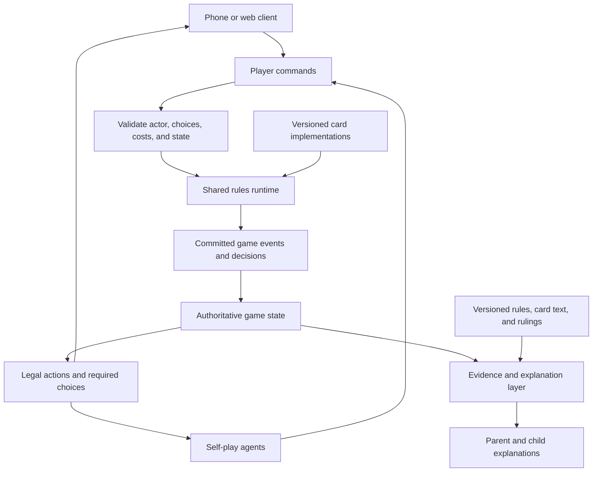

# Magic Coach: detailed project review and rules-correctness roadmap

**Review date:** 15 September 2026  
**Repository revision:** `f4dce0894a147235b94b4e9f87cf3ac9ababdfb6`  
**Audience:** product, engineering, QA, and contributors reviewing card implementations  
**Deliverable:** assessment and proposed work; application fixes are not included in this document  
**Primary requirement:** help a parent and nine-year-old learn and play Magic while respecting **all applicable Magic rules**.

Source links are relative to this file's location in `docs/`. Paths and line numbers refer to the revision above. The report can be shared by itself: findings, observed results, recommendations, and reproduction instructions are included here. Repository access is needed to inspect or run the code.

## Contents

- [1. Executive assessment](#1-executive-assessment)
- [2. Requirement and product implications](#2-requirement-and-product-implications)
- [3. Review scope, evidence, and limitations](#3-review-scope-evidence-and-limitations)
- [4. Findings at a glance](#4-findings-at-a-glance)
- [5. Detailed findings](#5-detailed-findings)
- [6. Rules coverage and structural gaps](#6-rules-coverage-and-structural-gaps)
- [7. Recommended architecture](#7-recommended-architecture)
- [8. The role of the LLM](#8-the-role-of-the-llm)
- [9. Testing and evaluation strategy](#9-testing-and-evaluation-strategy)
- [10. Delivery roadmap and acceptance gates](#10-delivery-roadmap-and-acceptance-gates)
- [11. Team backlog and implementation dependencies](#11-team-backlog-and-implementation-dependencies)
- [12. Decisions to record before implementation](#12-decisions-to-record-before-implementation)
- [13. Reproduction appendix](#13-reproduction-appendix)
- [14. Definition of success](#14-definition-of-success)

## 1. Executive assessment

**The current project does not satisfy the requirement to guide the family through all Magic rules.** It provides a partial game tracker, several deterministic calculators, and an LLM explanation layer. Some missing behavior is openly documented. Other missing behavior is presented as supported, and several concrete defects produce incorrect outcomes with the shipped Foundations data.

This distinction matters for prioritization:

- A documented unsupported interaction needs an implementation plan and an honest user-facing response.
- A supported-looking interaction that silently ignores a rule needs an immediate correctness fix.
- A model-generated answer with genuine citations still needs evidence that those citations support its conclusion.
- A replay that exactly reconstructs the recorded events can still reconstruct a game that was played incorrectly.

The most urgent findings are:

1. The mobile casting sequence pays by tapping lands, after which the API rejects the spell for insufficient untapped sources. Bypassing the payment sequence allows the API to cast without spending the sources.
2. Giant Growth can be offered, cast, and resolved without a creature to target. Its represented effect is not executed by resolution.
3. The shipped Pacifism data points restrictions at the Aura itself. The intended warning about unsupported attachments is therefore absent.
4. The engine accepts resolution from underneath another spell and accepts step advancement with spells still waiting.
5. The live game continues at zero life, and an empty-library draw becomes a rejected request instead of a recorded game outcome.
6. A newly played Forest can produce a Dazzling Angel creature-entry reminder.
7. Ordinary beginner questions retrieve unrelated rules, while the answer pipeline lacks the full card text needed for many interactions.

The project has useful foundations worth preserving:

- A mostly pure state-transition layer makes deterministic reproduction practical.
- Events and replay provide a good basis for undo, explanations, and debugging.
- The API, card data, calculations, and presentation are already separated into packages.
- The code contains explicit concepts for unknown cards and uncertain explanations.
- The automated test and static-analysis infrastructure is substantial.
- The existing distinction between `cited` and `trusted` recognizes that different checks establish different things.

However, **agreement with an incomplete engine is not evidence of complete rules correctness**. Nor is successful serialization of a card ability evidence that the engine can apply that ability.

### Recommended direction

Keep full rules coverage as the product objective. Build toward it through a shared rules runtime, complete and versioned source material, and independently specified scenario tests. Use the LLM to interpret questions and teach the result in accessible language. Track unsupported interactions explicitly during delivery so incremental implementation does not become a permanent reduction of the requirement.

## 2. Requirement and product implications

The product owner's clarification was:

> We need to follow ALL the rules of Magic. This is the whole point of this app — there are so many rules, we need this app to help us navigate these rules and guide me and my 9yo son.

That requirement should govern the implementation plan, acceptance tests, and language shown to the family.

### 2.1 What this means in practice

The app needs to answer several different questions correctly:

| User question | Required capability |
|---|---|
| “What does this rule mean?” | Retrieve the applicable rules and explain them accurately. |
| “What does this card do?” | Identify the card and use its current rules text and relevant rulings. |
| “Can I do this now?” | Evaluate the complete action against the actual state, choices, costs, and timing. |
| “What happens if I do this?” | Execute or simulate the applicable effects and subsequent required processing. |
| “What should I do?” | Compare legal choices, explain tradeoffs, and state assumptions about hidden information. |
| “What did we miss?” | Reconstruct the position and identify the specific overlooked action, condition, or trigger. |
| “Why did the answer change?” | Explain which game fact, rule version, card text, or implementation assumption changed. |

These capabilities overlap, but they are not interchangeable. A rules-search feature can explain a topic without being able to simulate it. A mana calculator can evaluate an available payment without proving that a spell is legal to cast. A combat calculation can be internally consistent while omitting a relevant ability.

### 2.2 Full coverage needs an explicit inventory

“All rules” should remain the destination. The team should translate it into a visible inventory of rule families, card behaviors, formats, and interactions, with implementation and validation status for each.

Selecting the order of delivery is reasonable. Quietly treating the Beginner Box as the permanent boundary is inconsistent with the clarified requirement.

The inventory should distinguish:

1. Rules that can be retrieved and explained.
2. Rules whose behavior the runtime can execute.
3. Interactions that have been tested together.
4. State that the app can capture from the physical table.
5. Format-specific behavior that has been configured and validated.

A rulebook file on disk does not complete items 2–5.

### 2.3 Teaching correctness includes handling incomplete information

In a physical game, the app may not know which creature an Aura enchants, whether damage is already marked, which mode was chosen, or whether an ability has resolved. When such a fact changes the answer, the correct product action is to request the fact or give a conditional explanation.

For example, the app can say:

> “I need to know which creature this Aura is attached to before I can check that attack.”

The short explanation for the child must preserve the same condition. Simplifying the wording must not convert a conditional answer into an unconditional “yes.”

### 2.4 Success is more than a plausible explanation

A successful interaction should establish:

- What the user asked and what game facts were assumed.
- Which rules and card text apply.
- Which parts were checked by executable logic.
- Whether any relevant interaction remains unsupported.
- What the player can choose next.
- A readable explanation for both parent and child.

The evidence can be expandable. The ordinary playing flow should stay simple.

## 3. Review scope, evidence, and limitations

### 3.1 Components examined

| Area | Review focus |
|---|---|
| `packages/core` | State, events, casting, movement, turn advancement, legality, mana, combat, and trigger scanning. |
| `packages/carddata` | Card-to-engine facts, sealed ability data, and the meaning of model coverage. |
| `packages/coach` | Playability reports, attack recommendations, unsupported-card reporting, board summaries, and explanation checks. |
| `packages/rules` | Rulebook loading, query construction, retrieval, prompt context, and citation validation. |
| `services/api` | Event parsing and validation, snapshots, sessions, rules questions, and casting integration. |
| `services/selfplay` | Action application, combat recording, and differences from the API path. |
| `apps/mobile` | The sequence of requests generated when a player casts a card and the displayed advice flow. |
| Tests and CI | Existing unit/integration coverage, use of real fixtures, local gates, and workflow differences. |

### 3.2 Evidence categories used in this report

- **Reproduced:** executed against the reviewed implementation and observed the described result.
- **Code-confirmed:** established from the implementation or data representation; not necessarily exercised through the UI.
- **Architectural gap:** required behavior cannot be represented or enforced by the reviewed design.
- **Recommendation:** proposed work or acceptance criteria; not an implemented or verified feature.

Where a reproduction bypasses another known defect to isolate a later transition, that is stated explicitly. A fabricated model answer is identified as a checker probe, not as an observed answer from a live model.

### 3.3 Checks that ran

The following full local gate completed successfully during the review:

```bash
uv run tools/gate.sh
```

Observed summary:

```text
Ruff lint: passed
Ruff formatting: 297 files already formatted
Mypy: no issues found in 292 source files
Pyright: 0 errors, 0 warnings, 0 informations
Python tests: 1704 passed, 2 warnings in 129.91s
Configured Python coverage: 100%
TypeScript typecheck: passed
Mobile tests: 8 test files, 132 tests passed
Full local gate: all gates passed
```

The coverage report included:

```text
Statements: 4660
Missed statements: 0
Branches: 1056
Partial branches: 0
Coverage: 100%
```

This percentage is limited to the source paths configured in [pyproject.toml](../pyproject.toml), starting at line 189. `services/selfplay/src` is absent from that coverage source list. Its tests still run; the reported percentage does not establish coverage of that service.

### 3.4 Rules-document verification

The project's default `data/rules/comprehensive.txt` was absent. Consequently, the local rules-phrasing and retrieval gates printed `SKIPPED` and returned success. The default server setup therefore lacks the document needed by its rules-question feature.

For the review, the document linked by the [official Wizards rules page](https://magic.wizards.com/en/rules) was downloaded into temporary storage. The reviewed URL was [MagicCompRules 20260819.txt](https://media.wizards.com/2026/downloads/MagicCompRules%2020260819.txt). The document itself states an effective date of August 7, 2026; retain the URL, effective date, and content hash separately rather than inferring one from another.

The existing retrieval benchmark passed **28 of 28 questions** against that full document. Additional questions in finding R06 exposed important misses. The 28/28 result is evidence about that benchmark only; it is not a measured accuracy rate for arbitrary family questions.

### 3.5 Limits of the assessment

- This was not a formal verification of the full Comprehensive Rules.
- No exhaustive card-by-card or interaction-by-interaction audit was performed.
- No live LLM calls were made. Model-answer correctness, latency, and real-world refusal rates were not measured.
- No physical-device or camera accuracy evaluation was performed.
- The browser UI was not manually exercised end to end. The payment defect was reproduced by sending the exact event sequence generated by the inspected mobile code.
- The existing mutation workflow was inspected, but a new full mutation run was not part of this review.
- Proposed work below is not a claim that these changes have been implemented.

## 4. Findings at a glance

Severity is assessed against the teaching requirement. **P1** means high-priority incorrect behavior or a capability gap that prevents reliable guidance. **P2** means a significant reliability or validation defect that should be corrected alongside the core work. These labels are proposed triage priorities, not a statement about production incident severity.

| ID | Priority | Finding | Evidence | Main consequence |
|---|---|---|---|---|
| R01 | P1 | Casting payment disagrees between the mobile flow and API | Reproduced | Paid casts fail; direct casts spend no payment. |
| R02 | P1 | Targets and spell effects are absent from execution | Reproduced and code-confirmed | An unsupported action can be presented as playable. |
| R03 | P1 | Pacifism's shipped data uses the wrong subject | Reproduced | Restrictions are ignored without the promised warning. |
| R04 | P1 | Priority and shared stack ordering are unenforced | Reproduced and architectural | Responses and step advancement cannot be governed correctly. |
| R05 | P1 | Game results, state-based checks, and cleanup are incomplete | Reproduced and architectural | The live state can continue past a loss condition. |
| R06 | P1 | Beginner questions retrieve unrelated passages | Reproduced | The model lacks the evidence needed to answer. |
| R07 | P1 | Answer context omits card text; citations do not validate conclusions | Code-confirmed and checker probe | A cited answer can still be unsupported or false. |
| R08 | P1 | Creature-entry reminders react to land entries | Reproduced | The app can prompt the family to apply a nonexistent trigger. |
| R09 | P2 | Self-play leaves attackers untapped and bypasses API checks | Reproduced and code-confirmed | Simulated games do not establish correctness of the live action path. |
| R10 | P2 | CI omits parts of the documented full gate | Code-confirmed | A green workflow provides less assurance than the README claims. |

## 5. Detailed findings

### R01 — Casting payment disagrees between the mobile flow and API

**Priority:** P1  
**Evidence:** reproduced using real Foundations card and effect fixtures.

**Relevant source:**

- [apps/mobile/src/playing.ts](../apps/mobile/src/playing.ts), lines 19–41: builds the payment, cast, and resolve sequence.
- [services/api/src/mtgcoach/api/guard.py](../services/api/src/mtgcoach/api/guard.py), lines 71–87: rechecks casting against available battlefield mana sources.
- [packages/coach/src/mtgcoach/coach/mana.py](../packages/coach/src/mtgcoach/coach/mana.py): excludes tapped permanents from available sources.
- [packages/core/src/mtgcoach/core/reduce.py](../packages/core/src/mtgcoach/core/reduce.py), lines 126–131: casting moves the card but consumes no payment.

#### Reproduction

Start in a main phase with one untapped Forest on the battlefield and Llanowar Elves in hand. The server reports:

```json
{
  "name": "Llanowar Elves",
  "playable": true,
  "reasons": [],
  "payment": {"tap": ["you-0"], "keep": []}
}
```

The mobile helper sends these requests in sequence:

```text
set_tapped(Forest, true)   -> HTTP 200
cast_spell(Llanowar Elves) -> HTTP 400
```

The refusal is:

```text
Llanowar Elves: you need 1 more untapped source
```

On a fresh equivalent position, sending only `cast_spell` returns HTTP 200. The Forest remains untapped.

#### Root cause

The action crosses two incompatible interpretations of payment:

1. The mobile client treats tapping as payment already made.
2. The API treats untapped permanents as the only evidence that payment is available.
3. The state records no mana produced by tapping.
4. The reducer moves the spell onto the stack without recording or consuming a payment.

The sequence also consists of separately committed HTTP requests. A later refusal leaves earlier taps in place.

#### User impact

The player follows the coach's instruction and receives a contradiction. The board is left partly changed. A retry can be confusing because the card remains in hand while the recommended land is tapped. The API's direct path exhibits the opposite accounting problem.

#### Recommended fix

Introduce a validated casting command containing the player's choices and payment plan. The shared runtime should validate and commit the cast consistently, accounting for mana already in a pool and mana abilities used during casting. Treat a request's cast-related changes as one coherent operation while retaining the underlying game events for explanation and replay.

Do not fix this by weakening the server check or merely swapping the mobile event order. Either approach would leave cost accounting dependent on client behavior.

Separately activated mana abilities are distinct prior actions; a rejected later cast must not blindly undo unrelated legitimate history. The transaction boundary needs to distinguish them from payment performed inside the casting process.

#### Acceptance tests

- A single Forest can pay for Llanowar Elves through the same action path used by the app.
- After a successful cast, payment is consumed exactly once.
- A failed cast does not leave that request's partial payment committed.
- A direct client cannot bypass cost consumption.
- Mana already produced is represented and usable where appropriate.
- Two clients submitting against the same position cannot both consume the same resources.
- Undo and replay preserve the complete casting transaction and its choices.

### R02 — Targets and spell effects are absent from execution

**Priority:** P1  
**Evidence:** reproduced targetless casting; effect-execution absence confirmed in code.

**Relevant source:**

- [packages/core/src/mtgcoach/core/events.py](../packages/core/src/mtgcoach/core/events.py), lines 49–88: cast and resolution data.
- [packages/core/src/mtgcoach/core/reduce.py](../packages/core/src/mtgcoach/core/reduce.py), lines 134–145: resolution only moves a card.
- [packages/core/src/mtgcoach/core/effects.py](../packages/core/src/mtgcoach/core/effects.py): represented effect types.
- [services/api/src/mtgcoach/api/cards.py](../services/api/src/mtgcoach/api/cards.py), lines 54–65: `modelled()` checks representation.
- [data/sets/FDN/effects.json](../data/sets/FDN/effects.json): Giant Growth's `ModifyStats` ability.

#### Reproduction

In a main phase with one Forest and no creatures on either battlefield:

```text
Giant Growth playable: true
Report unknown cards: []
Cast without any target field: HTTP 200
Resolve to graveyard: HTTP 200
```

The direct cast bypasses the separate payment defect in R01 to isolate target validation and resolution. This is not a claim that the normal mobile casting flow already works.

#### Root cause

`CastSpell` contains only a player and instance ID. There is no place to store target choices, modes, variable choices, or additional-cost selections. `ResolveSpell` provides a destination zone, and the reducer moves the card there. It never interprets the `SpellAbility` effects stored in the fixture.

The data layer can express Giant Growth's stat modification, so the card is classified as modelled. The coaching layer uses that classification even though execution cannot apply the represented effect.

This is a fundamental distinction between **describing an ability** and **implementing its behavior**.

#### User impact

The app can approve a card without the required choices, then update the tracker as if resolution completed. Subsequent advice uses a position that omits the effect. A model choosing from the offered cards can pass the existing recommendation checks despite that incomplete validation.

#### Recommended fix

Add explicit action choices and executable ability semantics. Build the legal-action offer from the same validation used when accepting the command. Recheck the relevant conditions at resolution. Record effect results, object changes, durations, and required follow-up choices.

Replace the single support boolean with separate evidence about identification, representation, execution support, and interaction coverage. Report support for the current question or action, not just for the card in isolation.

#### Acceptance tests

- Required targets must exist and be selected before a cast is accepted.
- Target properties and current restrictions are evaluated.
- Resolution executes the actual represented effect.
- Temporary modifications affect later calculations and expire through the appropriate processing.
- Optional choices are distinguished from missing required choices.
- A change to target validity between casting and resolution is handled explicitly.
- A represented but unimplemented effect cannot produce a fully verified playability claim.
- Tests use the shipped card fixture and assert final behavior, not only the shape of the encoded effect.

### R03 — Pacifism's shipped data silently suppresses the intended warning

**Priority:** P1  
**Evidence:** reproduced with the shipped sealed fixture and the full local Foundations import.

**Relevant source:**

- [data/sets/FDN/effects.json](../data/sets/FDN/effects.json), lines 2044–2073: Pacifism uses `self` for both restrictions.
- [packages/core/src/mtgcoach/core/targets.py](../packages/core/src/mtgcoach/core/targets.py): SELF denotes the source permanent.
- [packages/coach/src/mtgcoach/coach/statics.py](../packages/coach/src/mtgcoach/coach/statics.py): distinguishes source restrictions from restrictions on another permanent.
- [tests/coach/test_statics.py](../tests/coach/test_statics.py), line 25: the test supplies `ANY_CREATURE` instead.

#### Observed result

```text
Real FDN Pacifism: modelled=True
Combat caveats: ()
```

Both shipped restrictions contain:

```json
"affects": {
  "kinds": ["self"],
  "controller": "any",
  "minimum": 1,
  "maximum": 1,
  "conditions": []
}
```

#### Root cause

The fixture notes introduce an “Aura convention” in which `self` means the enchanted creature. The engine's target model gives the same value a different meaning: the permanent carrying the ability.

The combat warning code treats SELF restrictions as implemented source restrictions. Pacifism is therefore exempted from the attachment warning. Its own restriction has no useful effect on the creature calculations, and no warning explains the omission.

The existing test cannot catch this because its hand-built Pacifism representation points to `ANY_CREATURE`, which takes the warning branch.

#### User impact

The family can receive combat advice that fails to account for Pacifism while the card is classified as modelled. This is more serious than a clearly flagged unsupported attachment: the implementation's own disclosure path is defeated by its production data.

The reproduction demonstrates the missing warning. It does not demonstrate an actual attachment being tracked; the current state cannot express that relationship.

#### Recommended fix

Define an unambiguous reference to the enchanted permanent and store the actual attachment relationship. Correct the fixture and revalidate/reseal it through the established data workflow. Until the behavior is executable, mark this interaction unsupported and ensure the combat explanation carries that limitation.

Changing the fixture to “any creature” would only restore a warning; it would not identify the enchanted creature or implement Pacifism.

#### Acceptance tests

- The real shipped Pacifism entry produces the intended behavior or an explicit unsupported result.
- Source-permanent and attached-permanent references have distinct meanings through encode/decode and execution.
- Tests cover the attachment on either side of the table.
- Adding or removing the attachment updates the relevant action offers.
- The fixture cannot be considered validated solely because its checksum and JSON schema are valid.
- Runtime tests consume the same fixture that is packaged for users.

### R04 — Priority and shared stack ordering are unenforced

**Priority:** P1  
**Evidence:** reproduced out-of-order resolution and step advancement; missing state confirmed in code.

**Relevant source:**

- [packages/core/src/mtgcoach/core/state.py](../packages/core/src/mtgcoach/core/state.py), line 24: `GameState` has no priority holder or shared stack.
- [packages/core/src/mtgcoach/core/player.py](../packages/core/src/mtgcoach/core/player.py), line 28 onward: spells are held in per-player tuples.
- [packages/core/src/mtgcoach/core/reduce.py](../packages/core/src/mtgcoach/core/reduce.py), line 134: resolution checks membership, not the top of a shared stack.
- [packages/core/src/mtgcoach/core/turn.py](../packages/core/src/mtgcoach/core/turn.py), line 24: step advancement follows the next enum value.
- [packages/core/src/mtgcoach/core/steps.py](../packages/core/src/mtgcoach/core/steps.py): `has_priority` asks about a step, not which player holds priority.
- [apps/mobile/src/playing.ts](../apps/mobile/src/playing.ts), line 32: the normal action sequence immediately requests resolution.

#### Reproduction

Using the API's currently accepted direct casting path:

```text
Cast Llanowar Elves: HTTP 200
Cast Giant Growth: HTTP 200
Resolve Llanowar Elves from underneath Giant Growth: HTTP 200
```

On another position containing a pending spell:

```text
advance_step: HTTP 200
```

These probes isolate missing ordering checks. The setup also uses the independently defective target/payment handling described in R01–R02; it should not be read as a legal sequence to teach a player.

#### Root cause

The model does not record who may act next, consecutive passes, or a single ordering of spells and abilities across both players. Checking that a spell appears somewhere in one player's stack tuple is insufficient to authorize resolution.

The turn walker has no pending-choice or pending-stack contract. It can be called directly by the client. The mobile app's automatic cast-and-resolve sequence provides no deliberate response opportunity.

#### User impact

The app cannot reliably teach responses, passing, or when a spell takes effect. Any later implementation of counterspells, triggered abilities, or effects changing a pending spell's targets would lack the ordering machinery it needs.

#### Recommended fix

Add one ordered stack of spell and ability objects, an explicit priority holder, pass tracking, and pending decisions. Make resolution and step progression consequences of validated game flow. Preserve player ownership/controller information as attributes of objects rather than using separate collections as a substitute for global order.

A proposed “both players pass” UI shortcut should be implemented as an explicit authorized shortcut with appropriate stop points. It should not conceal unresolved choices or automatically decide the opponent's response.

#### Acceptance tests

- Both seats use one consistent stack order.
- A client cannot directly choose a lower stack object to resolve.
- Action permission depends on the current player and state.
- Passing, acting, and receiving priority produce the expected state transitions.
- Pending choices prevent unrelated progression.
- A response changes the sequence shown to both devices.
- Undo and replay preserve priority, choices, and stack ordering.

### R05 — Game results, state-based checks, and cleanup are incomplete

**Priority:** P1  
**Evidence:** reproduced zero-life continuation and empty-library refusal; other missing state confirmed by inspection.

**Relevant source:**

- [packages/core/src/mtgcoach/core/reduce.py](../packages/core/src/mtgcoach/core/reduce.py), line 59: life changes update a number.
- [packages/core/src/mtgcoach/core/turn.py](../packages/core/src/mtgcoach/core/turn.py), lines 42–70: only limited turn-entry actions are applied, and empty draws raise an error.
- [packages/core/src/mtgcoach/core/state.py](../packages/core/src/mtgcoach/core/state.py): no recorded game result.
- [packages/core/src/mtgcoach/core/permanents.py](../packages/core/src/mtgcoach/core/permanents.py): no persistent damage, counters, or temporary-effect state.
- [services/selfplay/src/mtgcoach/selfplay/playing.py](../services/selfplay/src/mtgcoach/selfplay/playing.py): a separate loop checks life totals outside the live game runtime.

#### Observed results

```text
change_life(you, -20): HTTP 200
State fields: turn, step, active_player, players
advance_step after reaching zero life: HTTP 200

draw_card from an empty library: HTTP 400
Detail: 'you' cannot draw from an empty library
```

These positions contained no represented effect that would explain continued play at zero life. The probe establishes absent result processing in the live API path.

#### Root cause

There is no shared stage that processes required consequences until the game reaches a stable decision point. A life change and a failed draw do not produce result state. Cleanup is an enum position rather than a complete transition with choices and consequences.

Combat's separate calculator knows some creature-death outcomes, but that knowledge is not a general state-based-action system. Likewise, self-play's life-total check does not make the API apply the same behavior.

#### User impact

The tracker and replay can continue from a position that should already have produced a result. Effects added later would encounter the same gap for deaths, attachments, counters, and other required state processing. The coach may keep recommending actions for a player whose game has ended.

#### Recommended fix

Represent outcomes in the shared game state and add a rules-driven stabilization stage at the appropriate boundaries. Include pending draw failures and cleanup decisions in the model. Preserve the distinction between applying an individual effect and reaching the point where required consequences are checked.

Do not implement this as “check all loss conditions after every primitive mutation.” Temporary intermediate values can occur during a larger operation. The processing boundary is part of the behavior that needs testing.

#### Acceptance tests

- A normal zero-life position reaches a recorded result through the live action path.
- Empty-library drawing is represented as game behavior rather than malformed input.
- No ordinary continuation commands are offered once the game has ended.
- Required cleanup choices are presented and resolved before progression.
- Damage and effect durations have explicit lifecycles.
- Multiple simultaneous consequences are processed consistently.
- Outcome changes and cleanup decisions replay identically on both API and self-play paths.

### R06 — Beginner questions retrieve unrelated passages

**Priority:** P1  
**Evidence:** reproduced against the full downloaded Comprehensive Rules.

**Relevant source:**

- [packages/rules/src/mtgcoach/rules/terms.py](../packages/rules/src/mtgcoach/rules/terms.py), line 79: bag-of-terms OR query construction.
- [packages/rules/src/mtgcoach/rules/search.py](../packages/rules/src/mtgcoach/rules/search.py), lines 39 and 107–137: eight results and title-weighted ranking.
- [services/api/src/mtgcoach/api/asking.py](../services/api/src/mtgcoach/api/asking.py), line 46: search is based on the question alone.
- [tools/check_retrieval.py](../tools/check_retrieval.py): current benchmark and skip behavior.

#### Exact observed examples

| Question | Returned references | Assessment |
|---|---|---|
| “When does my creature die from damage?” | `Planar Die`, `706.1`, `706.3`, `706.1b`, `706.1a`, `706.8b`, `706.8a`, `706.4` | All eight results concern dice. |
| “What happens if I run out of cards?” | `703.4a`, `502.1`, `610.4a`, `514.2`, `614.6`, `Phased In, Phased Out`, `702.26b`, `615.6` | No empty-library loss passage was returned. |
| “Can I cast Giant Growth without a creature?” | `707.4`, `810.9`, `601.3e`, `702.31b`, `702.28b`, `810.1`, `810.2`, `810.4` | The required target-choice passage was absent; unrelated topics occupied the budget. |

The existing test-question collection still passed 28/28. These observations are additional examples, not a representative statistical estimate of overall accuracy.

#### Root cause

The retrieval layer recognizes individual searchable words, adds selected phrases, and ORs the resulting terms. Rare or ambiguous words can dominate the ranking. “Die” is treated as a strong match for the noun used in dice rules.

Only eight passages survive. The pipeline does not use the board or exact card text to clarify the search, and does not recursively retrieve rules needed to complete an explanation. Any nonempty result set proceeds as a match; relevance and sufficiency are not separately established.

#### User impact

The model is instructed to answer from supplied passages. When the relevant passage is missing, it must either refuse, provide an incomplete answer, or overreach beyond its evidence. Better wording in the final prompt cannot recover evidence that was never supplied.

A child should not need to know the formal term or rule number before the rules assistant can find it.

#### Recommended fix

Use a retrieval process that can identify card names, interpret the question's intent, consider relevant state, retrieve multiple candidates, and check whether the result covers all necessary parts. Expand explicit rule references and supporting cross-references. Distinguish “some text matched” from “enough relevant evidence was found.”

Hybrid lexical/semantic search and reranking are candidate techniques, not an assumed cure. Compare them against the existing baseline using held-out family-style questions before selecting a design. Measure mistakes introduced by query rewriting as well as mistakes it fixes.

#### Acceptance tests

- The three examples above retrieve the required evidence.
- Paraphrases and everyday vocabulary work without hardcoding every tested sentence.
- Questions about named cards include their relevant text in the evidence set.
- Questions needing multiple rules retrieve the necessary combination.
- Irrelevant nonempty results do not receive a sufficiency claim.
- A held-out set evaluates new wording and interactions rather than only the phrases used during development.
- Retrieval results and corpus versions are recorded for failure analysis.

### R07 — Answer context omits card text, and citations do not validate conclusions

**Priority:** P1 under the clarified product requirement  
**Evidence:** code-confirmed context omission and a synthetic checker probe.

**Relevant source:**

- [packages/coach/src/mtgcoach/coach/table.py](../packages/coach/src/mtgcoach/coach/table.py), lines 30–62: the board summary includes an ability-presence flag but not the text.
- [packages/rules/src/mtgcoach/rules/question.py](../packages/rules/src/mtgcoach/rules/question.py): prompt construction.
- [packages/rules/src/mtgcoach/rules/answer.py](../packages/rules/src/mtgcoach/rules/answer.py), lines 92–137: answer and citation validation.
- [services/api/src/mtgcoach/api/asking.py](../services/api/src/mtgcoach/api/asking.py): returned `cited` and `matched` fields.

#### Observed checker behavior

A constructed answer containing:

```text
Answer: Trample doubles all damage.
Child explanation: Your creature hits twice as hard.
Citation: 702.19b
```

passes `verify()` with no problems when rule `702.19b` is included in the supplied passages.

**This was not generated by a live model.** It proves that the checker accepts this shape of unsupported conclusion. It does not measure how frequently a model would produce it.

#### Root cause

The checker establishes that citations came from the supplied set and that some answer text and citations are present. It does not connect each substantive claim to what the cited passage says.

The project deliberately names this result `cited`, and its documentation accurately describes the limitation. This finding is therefore partly a capability gap relative to the updated requirement, rather than an accusation that the boolean is implemented contrary to its definition.

Separately, the board prompt supplies names, printed statistics, keywords, and a warning that other rules text exists. A question about an ability may therefore lack both the actual card instruction and the relevant rule interaction. The current structure also has no complete record of pending spell choices to provide.

#### User impact

A parent or child may see a fluent explanation and real rule numbers without the conclusion being established. Printing the raw passages underneath helps inspection but transfers the difficult reasoning back to the family.

#### Recommended fix

Build an evidence package containing the relevant current card text, rulings, rules, and game facts. Have the answer identify its assumptions and supporting evidence for important claims. Compare executable claims with the shared engine when the interaction is supported.

Keep distinct statuses for evidence retrieved, citations validated, behavior checked, missing information, and unsupported interactions. Another LLM can help detect inconsistencies, but agreement between models must not be labelled as formal or deterministic validation.

#### Acceptance tests

- Card-ability questions receive exact relevant card text.
- A contradictory claim with a valid citation does not receive a stronger verified status.
- The child explanation preserves important conditions and limitations from the adult explanation.
- Missing attachment, target, or timing information prompts a targeted question.
- An unsupported interaction remains visibly unsupported even when the prose sounds confident.
- Recorded evaluations distinguish model error from retrieval error and missing game information.

### R08 — Creature-entry reminders react to land entries

**Priority:** P1  
**Evidence:** reproduced with Dazzling Angel's shipped ability.

**Relevant source:**

- [packages/core/src/mtgcoach/core/triggerscan.py](../packages/core/src/mtgcoach/core/triggerscan.py), lines 128–174: `arrivals()` and `_arrived_for()`.
- [packages/coach/src/mtgcoach/coach/warnings.py](../packages/coach/src/mtgcoach/coach/warnings.py): reminders assembled from current snapshots.
- [packages/core/src/mtgcoach/core/abilities.py](../packages/core/src/mtgcoach/core/abilities.py): a trigger already carries a subject specification.

#### Reproduction

Construct a battlefield containing:

- A Dazzling Angel that entered on turn 1.
- A Forest that entered on turn 2.

Ask for arrival reminders on turn 2 using the real fixture's abilities:

```text
[("Dazzling Angel", "another_creature_enters")]
```

#### Root cause

The scanner builds a set of every permanent that entered this turn. For `ANOTHER_CREATURE_ENTERS`, it tests only whether the set contains an ID other than the source's ID. It does not evaluate the trigger's creature condition.

The representation is also too coarse to establish event history. A turn number cannot distinguish which object arrived first, how many qualifying entries occurred, whether a qualifying object already left, or whether the trigger was resolved. Those are structural consequences of the design; the land-entry case is the directly reproduced defect.

#### User impact

The app can remind the family to process an ability that did not trigger. The same approach cannot reliably tell them how many trigger occurrences remain pending. For a teaching app, incorrect reminders are especially damaging because the user may reasonably assume that the coach caught something they missed.

#### Recommended fix

Detect triggers from actual events and the relevant before/after state. Evaluate the subject's characteristics and full conditions at the proper point. Give each trigger occurrence an identity, choices, and a pending/resolved lifecycle.

A quick creature filter would fix the demonstrated false positive, but it would not solve ordering, multiplicity, or lifecycle. Include both the immediate correction and the structural replacement in the backlog.

#### Acceptance tests

- A Forest entering does not generate this reminder.
- A qualifying creature entry generates the appropriate occurrence.
- Multiple qualifying events remain distinguishable.
- Changing event order changes the result when the source was not present for an earlier event.
- A later snapshot does not recreate already processed triggers.
- An object leaving the battlefield does not erase necessary event information.

### R09 — Self-play leaves attackers untapped and bypasses API checks

**Priority:** P2  
**Evidence:** reproduced attacker state; differing validation paths confirmed in code.

**Relevant source:**

- [services/selfplay/src/mtgcoach/selfplay/applying.py](../services/selfplay/src/mtgcoach/selfplay/applying.py), lines 51–66, 91–115, and 126–136.
- [services/selfplay/src/mtgcoach/selfplay/playing.py](../services/selfplay/src/mtgcoach/selfplay/playing.py): decision loop and separate outcome handling.
- [packages/core/src/mtgcoach/core/events.py](../packages/core/src/mtgcoach/core/events.py): no attack-declaration event.
- [services/api/src/mtgcoach/api/guard.py](../services/api/src/mtgcoach/api/guard.py): checks omitted by self-play's direct reducer calls.

#### Reproduction

Apply an unblocked attack with a settled Llanowar Elves through `selfplay.applying.attacked()`:

```text
Damage to defender: 1
Attacker tapped: False
Emitted event types: ["ChangeLife"]
```

The attack outcome is applied as life changes and movement of dead creatures. The attack declaration and its tap state are not applied.

#### Root cause and impact

Self-play consumes a combat calculator's aggregate result without representing the full sequence that produced it. Surviving attackers can remain available for later actions in a way the recorded game does not explain.

The harness also applies primitive events directly to the reducer, bypassing the API's card-aware guard. As a result, passing self-play casting scenarios do not establish that the mobile sequence succeeds through HTTP. R01 is an example of a defect hidden by that difference.

Event conservation checks remain valuable. They prove properties of the simulated log, but they cannot prove behavior that the log never represented.

#### Recommended fix

Give self-play agents the same validated command interface as human players. Add declared attackers, blockers, damage decisions, and their resulting state transitions to the shared runtime. Keep simulation-specific policy choices outside that runtime.

Maintain independent expected-outcome scenarios. “Both paths agree” is useful integration evidence, but if both use the same wrong rule implementation they can agree on an incorrect answer.

#### Acceptance tests

- The reproduced attack records the expected tap state.
- Relevant exceptions to ordinary attack behavior have separate scenarios.
- Live and self-play command execution agree on the same starting state and choices.
- Legality refusals occur in both paths.
- Replays preserve combat decisions and intermediate decision points.
- Self-play reports distinguish unsupported behavior, an agent's invalid choice, and an engine defect.

### R10 — CI omits parts of the documented full gate

**Priority:** P2  
**Evidence:** workflow and gate comparison.

**Relevant source:**

- [.github/workflows/ci.yml](../.github/workflows/ci.yml), lines 27–51.
- [tools/gate.sh](../tools/gate.sh).
- [pyproject.toml](../pyproject.toml), line 189 onward.
- [README.md](../README.md), development and gate instructions.

#### Observed discrepancy

| Check | Local full gate | CI workflow |
|---|---|---|
| Python lint, format, type checks | Runs | Runs |
| File-length and coverage-exclusion checks | Runs | Runs |
| Python tests and configured coverage | Runs | Runs |
| CLI-flag compatibility check | Runs | Omitted |
| Rules phrasing check | Runs, or explicitly skips if document absent | Omitted |
| Rules retrieval benchmark | Runs, or explicitly skips if document absent | Omitted |
| TypeScript typecheck | Runs when dependencies installed | Omitted |
| Mobile tests | Runs when dependencies installed | Omitted |

The workflow does not install the mobile dependencies. It therefore cannot be equivalent to the full local gate described in the README.

#### Impact

Changes to the mobile action flow or rules retrieval can pass the main CI workflow without the corresponding checks running. A “100% coverage” label can also be misread as whole-system assurance when its configured source scope excludes self-play and says nothing about omitted rules.

#### Recommended fix

Make the gate definition reusable by CI and developers, with environment differences recorded explicitly. Install mobile dependencies reproducibly with `npm ci`. Validate supported runtime tooling in a job that has the required prerequisites. Run rules evaluation against an identified document version and separately check for source updates.

For a product centered on rules guidance, a missing corpus should not silently count as a successful rules-quality evaluation. A deliberate tracker-only job can still run without it, provided the result says exactly what was checked.

#### Acceptance tests

- CI runs TypeScript typechecking and mobile tests.
- A failing mobile check makes the corresponding required job fail.
- The rules-quality job actually loads the intended corpus and reports its version.
- Missing rules produce an explicit job outcome appropriate to that job's purpose.
- Gate documentation matches the workflow.
- Coverage scope includes self-play if the team intends the percentage to cover every service.
- A test using the real mobile action sequence and real API catches R01.

## 6. Rules coverage and structural gaps

### 6.1 What the current coverage numbers mean

The sealed Foundations fixture contains 124 cards. Of these, 65 are classified as modelled because their represented abilities contain no explicit unmodelled element.

That is approximately 52% **schema coverage of this fixture**. It is not:

- The percentage of Magic rules implemented.
- The percentage of those cards whose behavior executes correctly.
- The percentage of interactions between those cards that are supported.
- The probability that a recommendation is correct.
- A measure of rules-question answer quality.

Giant Growth and Pacifism demonstrate why these measurements must be separated. Both are classified as modelled while the relevant behavior is missing or represented incorrectly.

### 6.2 Capability inventory

The following table identifies major work areas from the reviewed source. It is an architectural inventory, not an exhaustive mapping of every numbered rule. “Not represented” means the reviewed state or action model lacks the necessary concept; it does not imply that the rulebook search cannot find a passage about it.

| Capability | Reviewed implementation | Required engineering work |
|---|---|---|
| Card identity and zones | Instance IDs and basic zones exist. | Preserve identities and zone history across richer object behavior. |
| Event history and undo | Events replay from an initial state. | Add command boundaries, decisions, implementation versions, and migration policy. |
| Turn progression | A fixed step sequence with limited automatic actions. | Model conditional progression, pending choices, and turn/step modifications. |
| Priority | No priority holder or pass state. | Add player-specific action permission and passing. |
| Stack | Per-player collections of pending cards. | Add one ordered stack containing spells and abilities with choices and provenance. |
| Mana and costs | A bounded source-selection calculator; no persistent mana pool. | Track produced mana, consumption, restrictions, costs, and actual payment decisions. |
| Targeting | Target specifications exist in ability data. | Validate and record choices during actions and relevant checks during resolution. |
| Spell effects | Many effects are representable. | Execute each supported effect and its interaction with state processing. |
| Activated abilities | Ability schema and limited mana-source interpretation. | Offer and execute validated activations, costs, targets, and resulting objects. |
| Triggered abilities | Snapshot/turn-based reminders. | Detect actual occurrences and track pending abilities and choices. |
| Static abilities | Some self restrictions; some warnings for modifiers. | Calculate applicable restrictions and derived characteristics consistently. |
| Attachments | No attachment relationship on permanents. | Model attached objects and references to their hosts. |
| Counters and persistent damage | No general runtime representation on permanents. | Represent changes and include them in derived state and required checks. |
| Continuous effects and layers | No general execution system. | Add ordering, dependencies, durations, and characteristic evaluation. |
| Replacement and prevention | No general runtime mechanism. | Model proposed events, applicable modifications, and player choices. |
| Combat | Separate calculator supports a useful subset. | Integrate declarations, choices, response windows, damage state, and consequences. |
| State-based actions | Limited consequences inside isolated calculations. | Add a shared, correctly timed stabilization process. |
| Game outcomes | No result in core state; self-play has separate checks. | Record terminal and other result state consistently across clients and replays. |
| Ownership and control | Player-owned containers dominate the model. | Distinguish owner, controller, actor, and visibility. |
| Tokens and copies | Some creation behavior exists as schema types only. | Represent runtime objects and their lifecycle separately from physical cards. |
| Alternate card forms and choices | Card ingestion contains broader data than runtime state. | Preserve and execute the active form, chosen modes, and special casting choices. |
| Starting-game choices | Opening hands are dealt directly. | Inventory and implement the required setup and player decisions. |
| Multiplayer and variants | `PLAYER_COUNT = 2`; two-seat assumptions. | Add explicit format configuration, player order, teams, and variant state as required. |
| Rules-question evidence | Parsed rulebook and lexical search. | Add card-aware retrieval, evidence sufficiency, versioning, and answer evaluation. |

### 6.3 Suggested support records

Use records that describe the evidence for support. The following is an illustrative design, not an existing wire contract:

```yaml
card_identity: oracle-id
card_text_revision: reviewed-revision
ability:
  represented: true
  executable: false
  unsupported_features:
    - temporary_stat_modifier
validation:
  single_card_scenarios: []
  interaction_scenarios: []
current_request:
  action: cast
  legality_status: not_fully_evaluated
  missing_facts: []
  missing_capabilities:
    - target_validation
```

Support is contextual. An action can be fully checkable in one position and depend on an unsupported replacement or continuous effect in another. A card-level boolean alone cannot express this.

The user-facing text should describe the missing fact or behavior plainly. Internal implementation labels belong in diagnostics and contributor tools.

### 6.4 Rulebook references for implementation review

Use the [reviewed Comprehensive Rules](https://media.wizards.com/2026/downloads/MagicCompRules%2020260819.txt) when deriving expected behavior. Relevant sections include 101 and 108 for rule/card authority; 117 for priority; 601–608 for casting, abilities, and resolution; 613–616 for continuous, replacement, and prevention effects; 508–510 for combat; 514 for cleanup; and 704 for state-based actions. Record the version used by each rules scenario.

This report intentionally does not reproduce the rulebook. Proposed implementations must be checked against the full applicable passages and exceptions, not only the section labels above.

## 7. Recommended architecture

The following is a proposed architecture to address the findings. It preserves the useful separation in the repository while making one runtime responsible for validated game behavior.

### 7.1 Shared command execution



**Plain-text reading:** human players and self-play submit choices to the same validator. The runtime applies the rules and records what happened. The UI receives the resulting state and next choices. Explanations use that state together with versioned evidence.

### 7.2 Commands and events need different responsibilities

The current API accepts low-level events such as `move_card`, `set_tapped`, and `change_life`. That is useful for manual tracking, but it lets the caller dictate state changes without explaining the game action that authorizes them.

Introduce two explicit concepts:

- A **command** expresses a player's requested action and choices.
- An **event** records a change or decision accepted by the runtime.

Examples of proposed commands include casting a spell with choices, activating an ability, passing priority, declaring attackers, declaring blockers, and completing a requested decision. Resolution and required follow-up events are generated through the runtime's flow.

Manual corrections remain useful for synchronizing with a physical table. Record them as corrections, distinguish them from validated actions, and reevaluate which downstream conclusions remain established. This is a product-state distinction, not a reason to impose a new permission flow on ordinary play.

### 7.3 Keep the core pure while providing the facts it needs

The existing desire to keep I/O out of `core` is sound. It does not require the core to be unable to inspect card definitions.

Pass an immutable, versioned card-definition interface into the rules runtime. Loading SQLite, reading files, or fetching updates can remain outside. The runtime can then evaluate targets, costs, characteristics, and effects consistently without knowing where the data was stored.

This removes the need for correctness-critical checks to live only in `api.guard`, where other callers can omit them.

### 7.4 State must represent the facts that change the answer

The expanded state design should account for:

- The game format and configuration.
- Player order, active player, priority holder, and pending decisions.
- Ordered stack objects, their sources, controllers, targets, and choices.
- Object ownership, control, zones, forms, and relevant history.
- Mana, counters, attachments, marked damage, and temporary effects.
- Combat participation and damage choices.
- Trigger occurrences and their processing status.
- Game outcome and the reasons it was reached.
- The implementation and source-data versions used to interpret the position.

This is a design checklist rather than a proposed single large dataclass. Choose structures that make invalid states difficult to construct and transitions straightforward to inspect.

### 7.5 Use explicit decision points

Some actions need more information before execution can continue. Represent the needed decision rather than guessing it or embedding a free-form question only in LLM text.

For example:

```json
{
  "status": "choice_required",
  "decision_id": "decision-42",
  "player": "you",
  "kind": "choose_target",
  "allowed_object_ids": ["creature-1", "creature-2"],
  "minimum": 1,
  "maximum": 1
}
```

This example is illustrative. The final design must carry enough context for version checks, cancellation, replay, and validation. The client displays the allowed options; the server validates the submitted choice against the current decision.

### 7.6 Preserve atomicity without flattening the game

One HTTP transaction can contain multiple internal events. That is appropriate when they form a single committed action. It should not collapse separate game decisions, response opportunities, or independently initiated actions.

Recommended engineering properties:

- A command identifies the state revision it was based on.
- The runtime rejects stale or incompatible choices explicitly.
- A retry does not duplicate an already committed action.
- Related internal mutations are committed consistently.
- Events retain the detail needed for replay and explanation.
- Pending decisions survive reconnects and are visible to the relevant player.

These are proposed protections against integration problems, not additional concurrency defects reproduced by this review.

### 7.7 Derive characteristics consistently

Printed power, toughness, and keywords are inputs. Calculations should request the currently applicable characteristics from one shared evaluation layer. Combat, targeting, legality, and explanations must not independently construct different versions of the same creature.

That layer will need the relevant counters, attachments, effects, durations, and ordering rules. Until it can evaluate a relevant interaction, return an explicit inability to establish the result instead of quietly falling back to printed values.

### 7.8 Version the meaning of replays

An old event log can have at least two useful interpretations:

1. Reconstruct exactly what the recorded implementation produced.
2. Reevaluate the recorded choices under a newer implementation to identify changed behavior.

Label these operations distinctly. A rules-engine upgrade should not silently rewrite what the family sees as the historical game.

Record enough provenance to identify:

- Event and command schema versions.
- Engine/card implementation versions.
- Rulebook and card-text revisions.
- Initial state, choices, and randomness where relevant.
- Unsupported assumptions and manual corrections.

Add migration tests for the existing journals before expanding the event model.

### 7.9 Knowledge should be versioned separately from code

Use an identified snapshot of the rules, card text, and rulings for each evaluated game or answer. Retain content hashes and source URLs. Updating the rulebook should trigger retrieval and scenario evaluation; updating a card's text should invalidate affected implementation reviews and cached explanations.

A byte-valid download is insufficient evidence that the installed material is current, complete, and compatible with the evaluator. Keep checks for source identity, parsing completeness, expected structure, and the evaluations that depend on it.

### 7.10 Keep hidden information and observation uncertainty explicit

The current shared-token model and snapshots can expose both hands, as the project documentation acknowledges. Before claiming player-specific strategic guidance, define which facts each seat and each explanation may use.

For a physical table, also distinguish observed facts from inferred ones. A camera or manual input flow can be uncertain about a card or attachment. That uncertainty must travel into the answer rather than disappearing once a guessed ID enters the game state.

These are required design considerations for the broader product. This review did not perform a new authorization or recognition-accuracy audit.

## 8. The role of the LLM

### 8.1 The useful interpretation of “training on the rulebook”

The intuition is right that the app needs broad rules knowledge and an explanation style suitable for a child. Those needs can be addressed through several mechanisms with different jobs:

| Mechanism | Suitable role | Evidence it does not provide on its own |
|---|---|---|
| Retrieval | Bring relevant source passages and card text into the current answer. | That the selected passages are sufficient or correctly interpreted. |
| Runtime tools | Evaluate supported actions and transitions against the game state. | That all applicable behaviors have been implemented. |
| Prompting | Structure explanations, request assumptions, and set an age-appropriate style. | That generated claims are true. |
| Fine-tuning | Improve a measured behavior such as explanation consistency or tool use. | Complete coverage of every rule and interaction. |
| Model review | Detect some contradictions and omissions in another answer. | Independent proof of rules correctness. |
| Expert-labelled evaluations | Measure performance on defined scenarios and questions. | Correctness on every untested interaction. |

A training run may eventually help, but it should address a measured weakness. The immediate failures in this project include missing executable state and missing evidence; changing the model cannot supply those engineering capabilities by itself.

### 8.2 Suggested answer pipeline

1. **Understand the request.** Identify whether the user asks for a rule explanation, card explanation, legality check, outcome, or strategic suggestion.
2. **Resolve relevant entities.** Match named cards and objects in the game without guessing when multiple choices fit.
3. **Collect missing facts.** Ask only for details that could change the answer.
4. **Build evidence.** Retrieve applicable rules, exact relevant card text, and rulings; expand necessary cross-references.
5. **Check supported behavior.** Ask the shared runtime about the specific action or interaction.
6. **Assess remaining gaps.** Identify unsupported mechanics, uncertain observations, or incomplete evidence.
7. **Explain.** State the answer, next choice, and reasoning in suitable language.
8. **Validate the response.** Check structured fields, citations, consistency with runtime results, and preservation of qualifications.
9. **Record the case.** Retain versions, evidence, result, and any refusal for evaluation and debugging.

This is proposed orchestration, not a claim that a model can automatically decide evidence sufficiency perfectly. That decision itself needs evaluation and conservative handling of unresolved cases.

### 8.3 Separate legality from strategy

The runtime should establish which actions are available and what supported transitions do. Strategy can compare those actions using explicit assumptions and incomplete information.

An exhaustive search of a restricted combat model is exhaustive only within that model. It does not prove that an attack is optimal in the full game. Unknown cards, responses, effects, and future turns can matter.

Present strategic advice as a recommendation with its relevant assumptions. Reserve stronger correctness language for specific claims the runtime actually checked.

### 8.4 Parent and child presentation

Recommended presentation:

- **Short answer:** one or two clear sentences.
- **Next choice:** an actionable button or a concrete question.
- **Why:** a concise explanation using the actual cards on the table.
- **Evidence:** expandable rules and card text for the parent.
- **Limits:** any missing fact or unsupported interaction that changes the conclusion.

Avoid making the family understand internal confidence scores, search ranks, or implementation flags. Translate those into meaningful statements such as “I need one more detail” or “I can explain the rule, but I cannot verify this interaction yet.”

### 8.5 Training data and feedback

If fine-tuning is evaluated later, use reviewed examples that retain the game facts, authoritative evidence, expected behavior, and teaching explanation. Include corrections and appropriate requests for clarification.

Do not treat current self-play journals or all `cited=true` answers as correct training labels. The findings show why those signals can contain erroneous or unsupported examples. Establish a review process for turning logs into labelled examples, and keep evaluation cases separate from training material.

## 9. Testing and evaluation strategy

### 9.1 Why the existing suite missed the findings

Several different assurance gaps are visible:

| Gap | Example in this review | Needed improvement |
|---|---|---|
| Tests assert implementation shape | The mobile test expects taps, cast, then resolve. | Execute the sequence through the actual API and assert its outcome. |
| Unit fixtures differ from production data | Pacifism uses a different target specification in its test. | Load and test the shipped sealed fixture. |
| Different callers use different checks | Self-play bypasses the API guard. | Share command validation and test equivalence of entry points. |
| Representation is treated as behavior | Giant Growth has an encoded effect but no executor. | Assert the final state and later consequences of resolving the card. |
| A benchmark is too narrow | 28 retrieval cases pass while natural paraphrases miss. | Add held-out and independently written questions. |
| Invariants omit the relevant fact | An attack preserves card counts while leaving its attacker untapped. | Assert action-specific rules outcomes and state transitions. |
| Coverage omits absent functionality | No priority field means no priority implementation to cover. | Maintain a behavior inventory outside line coverage. |

The response should be better tests with independent expected outcomes, not simply a higher test count.

### 9.2 Scenario format

A rules scenario should include:

```yaml
id: casting_single_green_payment
purpose: A cast consumes the selected payment through the shared command path.
sources:
  rules_version: explicit-version
  card_text_version: explicit-version
  reviewed_references: [reviewed-rule-references]
initial_state:
  description: Main phase; one untapped Forest; Llanowar Elves in hand.
choices:
  description: Cast Llanowar Elves using the Forest.
expected:
  command_accepted: true
  payment_consumed_once: true
  spell_state: pending_on_stack
entry_points:
  - shared_runtime
  - api
  - mobile_integration
```

This is an example of test metadata, not executable project configuration. The implemented test should specify concrete objects, choices, and assertions.

### 9.3 Required layers of validation

1. **Primitive tests:** identity, zones, data parsing, and serialization.
2. **Behavior tests:** complete actions with positive and negative cases.
3. **Interaction tests:** combinations whose ordering or conditions change the result.
4. **Fixture tests:** actual shipped cards through execution.
5. **Integration tests:** the mobile/API/shared-runtime contract.
6. **Replay tests:** decisions and state across implementation/schema versions.
7. **Rules-answer evaluations:** retrieval and explanation quality against labelled cases.
8. **Family usability sessions:** whether users understand the question, next choice, and explanation.

Property tests and mutation tests remain valuable within these layers. Neither replaces independent examples of correct game behavior.

### 9.4 Rules-answer metrics

Measure separate stages so a regression can be diagnosed:

| Metric | What to measure |
|---|---|
| Evidence recall | Whether all required sources for the labelled question were retrieved. |
| Evidence relevance | How much of the context is useful rather than distracting. |
| Answer correctness | Whether the conclusion matches the reviewed expected answer and assumptions. |
| Citation support | Whether the cited evidence supports the associated claim. |
| Clarification quality | Whether missing facts that change the answer are requested. |
| Appropriate abstention | Whether unsupported cases avoid an unjustified definitive answer. |
| Child/adult consistency | Whether simplification preserves the answer's conditions and meaning. |
| Action consistency | Whether the answer agrees with the validated runtime result. |
| Latency | Time to a useful answer or required clarification. |

Set thresholds after collecting a representative baseline. This review does not establish numerical accuracy targets or observed model performance.

Keep failure classes visible. A correct refusal due to missing information is different from a refusal caused by poor retrieval; both differ from a confidently wrong answer.

### 9.5 Fixture and source maintenance

- Store the provenance of card text and the version reviewed for each implementation.
- Recheck affected cards when text or engine semantics change.
- Use fixture checksums for integrity and separate behavior tests for correctness.
- Include source-version identifiers in evaluation output.
- Keep stable regression cases and a held-out set for generalization.
- Review generated scenarios before they become trusted labels.
- Avoid blindly collecting the entire rulebook or private game logs into model prompts; select the relevant evidence and preserve player visibility.

### 9.6 Revised CI structure

A practical job structure is:

| Job | Purpose | Required input |
|---|---|---|
| Python checks | Lint, format, types, relevant gate scripts, tests, and scoped coverage. | Locked Python workspace. |
| Mobile checks | TypeScript and component/client tests. | Dependencies installed from the lockfile. |
| Live action integration | Real fixtures and client/API action sequences. | Test server and shared runtime. |
| Rules regression | Parser, phrasing, retrieval, and labelled deterministic cases. | An identified rules snapshot. |
| Tool compatibility | Verify configured external tooling assumptions. | Supported tooling installed in an appropriate environment. |
| Model evaluation | Measure actual generated answers separately from deterministic tests. | Explicit model/configuration and approved evaluation setup. |
| Scheduled deeper checks | Mutation testing, broader self-play, and source-update checks. | Versioned inputs and retained failure artifacts. |

Model evaluation should be explicit because it has different cost, latency, and reproducibility properties from unit tests. Deterministic CI should not accidentally invoke a live model.

## 10. Delivery roadmap and acceptance gates

The phases below establish dependencies and reviewable outcomes. They are not calendar estimates. A credible schedule requires implementation spikes and team capacity information that this review did not collect.

### Phase A — Correct current contradictions and define support honestly

**Scope:** R01, R03, the demonstrated false positive in R08, and the misleading relationship between modelled data and verified behavior.

**Deliverables:**

- A consistent casting/payment path for the currently supported cases.
- Corrected Pacifism representation or explicit unsupported handling.
- No land-entry false positive for Dazzling Angel.
- Regression tests using real fixtures and the API action sequence.
- Documented statuses for incomplete legality/effect evaluation.
- CI coverage of the mobile and relevant integration checks.

**Exit gate:** the confirmed contradictions are reproduced by tests, fixed, and verified through the actual user action path. Unsupported effects no longer inherit a fully verified status from schema coverage.

**Dependency note:** a tactical payment fix must fit the shared command model. Avoid a temporary client workaround that will conflict with the next phase.

### Phase B — Build the shared action, priority, and stack foundation

**Scope:** R04 and the validation split behind R09, plus the state required by casting.

**Deliverables:**

- Shared commands for the API and self-play.
- A single stack containing the required object types.
- Priority and explicit pass/decision handling.
- Validated choices and coherent action commits.
- State revision and retry semantics.
- A replay compatibility plan for the changed event model.

**Exit gate:** the same choices from the same starting state produce the same validated results through API and self-play; out-of-order resolution and arbitrary progression are refused by the shared layer.

### Phase C — Execute effects and required state processing

**Scope:** R02, R05, the structural trigger work in R08, and combat execution in R09.

**Deliverables:**

- Executable effect families with documented support.
- Target and choice validation at the relevant action stages.
- Trigger occurrence tracking and pending decisions.
- Game outcomes and shared state-based processing.
- Damage, counters, durations, and cleanup state.
- Actual attacker/blocker declarations and combat transitions.

**Exit gate:** reviewed single-card and interaction scenarios pass through the shared runtime and replay. The shipped fixture's claimed supported behaviors have executable tests. Remaining unsupported interactions are identifiable by the runtime.

### Phase D — Broaden interactions and format coverage

**Scope:** the capability inventory in section 6 beyond the initial implemented subset.

**Deliverables:**

- Ownership/control, attachments, and derived characteristics.
- Continuous, replacement, and prevention effect handling.
- Tokens, copies, alternative choices, and other missing object behavior.
- Starting-game and format-specific state and decisions.
- A complete inventory of remaining rule families and interactions.

**Exit gate:** each newly claimed family has positive, negative, interaction, and replay evidence. Shipping one family does not silently mark unrelated mechanics complete.

This phase can be split into smaller releases. “All rules” is the objective; the release notes should state exactly what became supported and what remains.

### Phase E — Upgrade the rules assistant and teaching flow

**Scope:** R06–R07 and the parent/child experience.

**Deliverables:**

- Versioned rules, Oracle text, and relevant rulings available to the answer pipeline.
- Card-aware and state-aware retrieval with supporting-reference expansion.
- Missing-fact clarification and contextual support reporting.
- Reviewed answer evaluations with held-out beginner questions.
- Short explanations that retain the adult answer's conditions.
- Standalone rules questions as well as questions about a live game.

**Exit gate:** measured performance improves on the defined evaluation sets without hiding increased overconfidence or unnecessary refusals. Supported action explanations match the shared runtime.

Retrieval and evaluation work can begin while runtime work proceeds. This is an implementation dependency observation, not a claim that a separate agent or workstream has already been assigned.

### Phase F — Establish release evidence for broad correctness

**Scope:** the accumulated implementation and its maintenance process.

**Deliverables:**

- Rule-family and interaction coverage reports linked to tests.
- Reviewed production fixtures and update procedures.
- Consistent live, self-play, and replay behavior.
- Representative family sessions and recorded usability failures.
- Documentation that distinguishes implemented behavior, evaluated guidance, and unresolved gaps.

**Exit gate:** release claims are supported by the inventory and evidence. A green test suite alone is not the release argument for complete Magic rules coverage.

## 11. Team backlog and implementation dependencies

The following tickets are suggested work items. Roles are indicative; no work has been assigned and no external messages were sent.

| Ticket | Suggested owner | Outcome | Dependencies |
|---|---|---|---|
| GAME-01 | Runtime + API | Shared validated command boundary and commit semantics. | Design decisions in section 12. |
| GAME-02 | Runtime + mobile | Correct payment through the real casting flow. | GAME-01 direction; R01 regression first. |
| DATA-01 | Card data + QA | Pacifism subject semantics corrected and real-fixture regression. | Attachment reference design; immediate unsupported handling can precede execution. |
| GAME-03 | Runtime | Priority, ordered stack, and progression. | GAME-01. |
| GAME-04 | Runtime | Targets, modes, choices, and executable spell effects. | GAME-01 and GAME-03. |
| GAME-05 | Runtime | Results, state-based processing, cleanup, and duration handling. | Shared state/effect contracts. |
| GAME-06 | Runtime + card data | Event-driven triggers and lifecycle. | Event context and GAME-03. |
| GAME-07 | Runtime + self-play | Combat declarations and identical command execution paths. | GAME-01, GAME-03, GAME-05. |
| GAME-08 | Runtime | Attachments, control changes, and derived characteristics. | Shared object model. |
| GAME-09 | Runtime | Broader replacement/prevention and variant support. | Inventory and earlier runtime foundations. |
| KNOW-01 | Data + rules | Versioned corpus/card-text/rulings package. | Source provenance and update policy. |
| KNOW-02 | Rules + evaluation | Improved retrieval and evidence sufficiency. | KNOW-01 and held-out evaluation set. |
| COACH-01 | Coaching + product | Explicit answer evidence, assumptions, and child/adult consistency. | KNOW-01; runtime integration as available. |
| QA-01 | QA + contributors | Independently specified rules and interaction scenarios. | Can begin immediately. |
| QA-02 | QA + mobile/API | Real client-to-server action tests. | Can begin with R01 reproduction. |
| CI-01 | Developer tooling | CI/local-gate parity and visible rules prerequisites. | Environment/tooling policy. |
| REPLAY-01 | Runtime + API | Versioned logs and migration/reevaluation behavior. | GAME-01 state/event design. |
| PRODUCT-01 | Product + design | Physical-table corrections, missing facts, and teaching choices. | Support-state design. |

For each ticket, include the original finding, a minimal failing scenario, intended behavior, chosen rule/source version, final assertions, and remaining unsupported cases. That keeps implementation review tied to the actual user problem.

## 12. Decisions to record before implementation

These are design decisions for the team to document. They do not change the stated goal of full rules coverage.

1. **Release sequence:** which rule families and formats are implemented first, and how unfinished coverage is reported.
2. **Runtime sourcing:** extend this engine, integrate an existing implementation, or combine components. Evaluate correctness evidence, suitability for explanations, determinism, maintenance, and integration constraints before selecting a dependency. This review did not evaluate external engines.
3. **State capture:** which facts come from the app, manual correction, or later recognition; how uncertain observations are represented.
4. **Command semantics:** actor identity, state revision, retries, cancellation, commit boundaries, and pending decisions.
5. **Source versions:** how rules, card text, rulings, and implementations are identified, updated, and pinned for a game.
6. **Replay policy:** historical reconstruction versus reevaluation under a newer engine, and migration behavior for existing journals.
7. **Support claims:** what evidence permits “verified,” “cited,” “unsupported,” and “needs more information” in internal and user-facing contracts.
8. **Test authority:** who reviews expected outcomes for complicated scenarios and how disagreements are resolved against source material.
9. **Privacy and visibility:** which player-specific information the coach can use, and what game data is retained for evaluation.
10. **Release evidence:** which deterministic checks, model evaluations, and family usability cases are required for each claimed capability.

## 13. Reproduction appendix

Run these snippets from the repository root in the reviewed checkout after installing the workspace dependencies. They use in-process test clients and local fixture data. They do not invoke the coach or rules-answer model endpoints.

These are diagnostic probes of the reviewed behavior. They print observations rather than defining the long-term test contract. Convert them into properly specified regression tests when implementing the fixes.

### 13.1 API payment, targeting, ordering, and outcome probes

The setup intentionally uses a small fixed deck for reproducibility. Direct casts isolate later missing checks despite R01. See the detailed findings for why the full sequence is not an example of legal play.

```bash
uv run python - <<'PY'
from pathlib import Path

from fastapi.testclient import TestClient
from mtgcoach.api.app import create_app
from mtgcoach.api.cards import build
from mtgcoach.carddata.scryfall import cards_in
from mtgcoach.carddata.sealed import load

root = Path.cwd()
catalogue = build(
    cards_in(root / "tests/fixtures/scryfall_fdn_playable.json"),
    root / "data/sets/FDN/effects.json",
)
by_name = {card.name: oid for oid, card in catalogue.cards.items()}
names = [
    "Forest", "Forest", "Forest", "Llanowar Elves",
    "Druid of the Cowl", "Giant Growth", "Forest",
    "Forest", "Druid of the Cowl", "Forest",
]
deck = tuple(by_name[name] for name in names)
token = "review-fixture-token"
headers = {"Authorization": f"Bearer {token}"}

with TestClient(
    create_app(catalogue, {"green": deck}, token), headers=headers
) as client:
    def event(sid, kind, **fields):
        return client.post(
            f"/games/{sid}/events", json={"type": kind, **fields}
        )

    def game():
        response = client.post("/games", json={"you": "green", "them": "green"})
        response.raise_for_status()
        body = response.json()
        sid = body["session_id"]
        for _ in range(3):
            response = event(sid, "advance_step")
            response.raise_for_status()
            body = response.json()
        return sid, body

    def offered(body, name):
        return next(
            card for card in body["advice"]["you"]["hand"]
            if card["name"] == name
        )

    def with_forest():
        sid, body = game()
        card = offered(body, "Forest")
        response = event(
            sid, "play_land", player="you", instance_id=card["instance_id"]
        )
        response.raise_for_status()
        return sid, response.json()

    # R01: the sequence generated by the mobile helper.
    sid, body = with_forest()
    elves = offered(body, "Llanowar Elves")
    print("Elves offer:", elves)
    for source in elves["payment"]["tap"]:
        response = event(
            sid, "set_tapped", player="you", instance_id=source, tapped=True
        )
        print("Payment tap:", response.status_code)
    response = event(
        sid, "cast_spell", player="you", instance_id=elves["instance_id"]
    )
    print("Cast after payment:", response.status_code, response.json())

    # R01 and R04: direct cast, followed by advancing with a pending spell.
    sid, body = with_forest()
    elves = offered(body, "Llanowar Elves")
    response = event(
        sid, "cast_spell", player="you", instance_id=elves["instance_id"]
    )
    print("Direct cast:", response.status_code)
    if response.is_success:
        board = response.json()["state"]["players"]["you"]["battlefield"]
        print("Land tap states:", [card["tapped"] for card in board])
    print("Advance with pending spell:", event(sid, "advance_step").status_code)

    # R02: no creature is on either battlefield.
    sid, body = with_forest()
    growth = offered(body, "Giant Growth")
    print("Growth playable with no creature:", growth["playable"])
    print("Unknown cards:", body["advice"]["you"]["unknown"])
    print("Targetless cast:", event(
        sid, "cast_spell", player="you", instance_id=growth["instance_id"]
    ).status_code)
    print("Targetless resolution:", event(
        sid, "resolve_spell", player="you",
        instance_id=growth["instance_id"], to="graveyard"
    ).status_code)

    # R04: isolate ordering after the currently accepted direct casts.
    sid, body = with_forest()
    elves = offered(body, "Llanowar Elves")
    growth = offered(body, "Giant Growth")
    for card in (elves, growth):
        print("Stack cast:", card["name"], event(
            sid, "cast_spell", player="you", instance_id=card["instance_id"]
        ).status_code)
    print("Resolve lower spell:", event(
        sid, "resolve_spell", player="you",
        instance_id=elves["instance_id"], to="battlefield"
    ).status_code)

    # R05: a fresh game with no pending spells or special battlefield effects.
    sid, body = game()
    response = event(sid, "change_life", player="you", amount=-20)
    print("Reach zero life:", response.status_code)
    print("State fields:", list(response.json()["state"]))
    print("Continue at zero:", event(sid, "advance_step").status_code)

with TestClient(
    create_app(catalogue, {"green": deck[:7]}, token), headers=headers
) as client:
    response = client.post("/games", json={"you": "green", "them": "green"})
    response.raise_for_status()
    sid = response.json()["session_id"]
    response = client.post(
        f"/games/{sid}/events", json={"type": "draw_card", "player": "you"}
    )
    print("Empty-library draw:", response.status_code, response.json())

cards = load(root / "data/sets/FDN/effects.json")
print("Fixture cards:", len(cards))
print("Schema-modelled:", sum(card.is_modelled for card in cards))
PY
```

### 13.2 Pacifism and Dazzling Angel fixture probes

This probe needs only committed fixture files. It does not require a full Scryfall import. The catalogue intentionally has no card facts: the two inspected paths use the sealed abilities, and the Pacifism check only asks whether a caveat is emitted. The earlier full-import reproduction confirmed the same absent caveat.

```bash
uv run python - <<'PY'
from pathlib import Path

from mtgcoach.api.cards import Catalogue
from mtgcoach.carddata.sealed import load
from mtgcoach.coach.statics import caveats
from mtgcoach.core.cards import CardInstance
from mtgcoach.core.ids import InstanceId
from mtgcoach.core.permanents import Permanent
from mtgcoach.core.triggerscan import arrivals

cards = load(Path("data/sets/FDN/effects.json"))
by_name = {card.name: card for card in cards}
by_id = {card.oracle_id: card for card in cards}
catalogue = Catalogue(rules={
    str(card.oracle_id): card.abilities for card in cards
})

pacifism = by_name["Pacifism"]
permanent = Permanent(CardInstance(InstanceId("aura"), pacifism.oracle_id))
print("Pacifism modelled:", catalogue.modelled(pacifism.oracle_id))
print("Pacifism caveats:", caveats(((permanent,),), catalogue))

angel = Permanent(
    CardInstance(InstanceId("angel"), by_name["Dazzling Angel"].oracle_id),
    entered_on_turn=1,
)
forest = Permanent(
    CardInstance(InstanceId("forest"), by_name["Forest"].oracle_id),
    entered_on_turn=2,
)
reminders = arrivals(
    (angel, forest),
    lambda oid: by_id[oid].abilities,
    lambda oid: by_id[oid].name,
    2,
)
print("Angel plus new Forest:", [(r.name, r.event.value) for r in reminders])
PY
```

Observed results at the reviewed revision:

```text
Pacifism modelled: True
Pacifism caveats: ()
Angel plus new Forest: [('Dazzling Angel', 'another_creature_enters')]
```

### 13.3 Full-rulebook retrieval and citation-check probes

For reproducibility, this uses the exact reviewed URL rather than whatever document a later release links. To evaluate a newer rules release, replace the URL and record the new document's identity; the returned references and ranking may change.

```bash
export MAGIC_REVIEW_RULES=/tmp/magic-coach-review-rules-20260819.txt
curl -fsSL \
  'https://media.wizards.com/2026/downloads/MagicCompRules%2020260819.txt' \
  -o "$MAGIC_REVIEW_RULES"
```

Then run:

```bash
uv run python - <<'PY'
import hashlib
import os
import sys
from collections import Counter
from pathlib import Path

sys.path.insert(0, str(Path.cwd() / "tools"))
from check_retrieval import QUESTIONS, asked, verdicts
from mtgcoach.rules.answer import Answer, verify
from mtgcoach.rules.library import index_at

path = Path(os.environ["MAGIC_REVIEW_RULES"])
print("Rules SHA-256:", hashlib.sha256(path.read_bytes()).hexdigest())
questions = [
    "When does my creature die from damage?",
    "What happens if I run out of cards?",
    "Can I cast Giant Growth without a creature?",
]
with index_at(path) as index:
    benchmark = verdicts(index, asked(QUESTIONS))
    print("Existing benchmark:", dict(Counter(row[0] for row in benchmark)))
    for question in questions:
        print(question)
        print([(p.reference, p.title) for p in index.search(question)])

    # A fabricated answer to test the checker; no LLM is called.
    supplied = index.cited(["702.19b"])
    assert supplied, "The reviewed rule must exist for this probe."
    answer = Answer(
        answer="Trample doubles all damage.",
        in_short="Your creature hits twice as hard.",
        citations=("702.19b",),
    )
    print("Contradictory-answer check problems:", verify(answer, supplied))
PY
```

At the reviewed revision, the benchmark returned `{'ok': 28}` and the fabricated answer's problem list was `()`. See R06 for the observed retrieval references.

### 13.4 Self-play attacker-state probe

This directly exercises the self-play application function with a combat plan from the real calculator. The fixed initial position isolates the missing tap transition.

```bash
uv run python - <<'PY'
from dataclasses import replace
from pathlib import Path

from mtgcoach.api.cards import build
from mtgcoach.carddata.scryfall import cards_in
from mtgcoach.core.cards import CardInstance
from mtgcoach.core.combat.model import Creature
from mtgcoach.core.combat.search import plans
from mtgcoach.core.events import MoveCard
from mtgcoach.core.ids import InstanceId, OracleId, PlayerId
from mtgcoach.core.reduce import apply
from mtgcoach.core.state import start_game
from mtgcoach.core.steps import Step
from mtgcoach.core.zones import ZoneName
from mtgcoach.selfplay.applying import attacked

catalogue = build(
    cards_in(Path("tests/fixtures/scryfall_fdn_playable.json")),
    Path("data/sets/FDN/effects.json"),
)
elf_id, elf_facts = next(
    (oid, facts) for oid, facts in catalogue.cards.items()
    if facts.name == "Llanowar Elves"
)
you, them = PlayerId("you"), PlayerId("them")
libraries = {
    player: tuple(
        CardInstance(InstanceId(f"{player}-{i}"), OracleId(elf_id))
        for i in range(10)
    )
    for player in (you, them)
}
state = start_game(libraries, you)
state = apply(state, MoveCard(you, InstanceId("you-0"), ZoneName.BATTLEFIELD))
mine = state.player(you)
state = state.with_player(
    you, replace(mine, battlefield=tuple(p.settle() for p in mine.battlefield))
)
state = replace(state, step=Step.DECLARE_ATTACKERS)
creature = Creature(state.player(you).battlefield[0], elf_facts)
plan = next(plan for plan in plans((creature,), (), 20) if plan.attackers)
result = attacked(state, you, plan)
print("Damage:", 20 - result.state.player(them).life)
print("Attacker tapped:", result.state.player(you).battlefield[0].tapped)
print("Events:", [type(event).__name__ for event in result.events])
PY
```

Observed:

```text
Damage: 1
Attacker tapped: False
Events: ['ChangeLife']
```

### 13.5 Re-running the existing automated checks

For a development checkout with the workspace and mobile dependencies installed:

```bash
uv run tools/gate.sh
```

For a fresh checkout, follow the repository's dependency installation instructions first. The full gate requires the mobile dependencies unless an explicit skip is selected. A skipped app or rules check should be recorded as skipped in any shared result.

The report's successful gate results were measured during the review. They are not a promise that a later dependency or code revision will produce the same results.

## 14. Definition of success

### 14.1 Product and engineering completion criteria

The project is ready to make a broad correctness claim only when the team can supply evidence for that claim. A useful completion checklist is:

- [ ] The required rule families and formats are inventoried, with unresolved work visible.
- [ ] Claimed supported actions use one validated runtime across live play and self-play.
- [ ] The runtime represents the choices and game facts that affect each supported result.
- [ ] Card representations are tested as executable behavior using the shipped data.
- [ ] The confirmed findings in this report have regression tests and verified resolutions.
- [ ] Priority, stack ordering, payment, effects, triggers, combat, and automatic consequences are covered by interaction scenarios.
- [ ] Unknown or unsupported interactions cannot silently inherit a fully verified result.
- [ ] Rules answers include the relevant evidence and request missing facts when necessary.
- [ ] The short explanation preserves the meaning and conditions of the parent explanation.
- [ ] Rules, card text, implementations, and replay formats are versioned and maintained.
- [ ] CI executes the checks claimed in the development documentation.
- [ ] Evaluations distinguish executable correctness, source retrieval, generated-answer quality, and usability.
- [ ] Historical replay and reevaluation under a newer engine are clearly distinguished.
- [ ] Family testing confirms that the app helps users choose and understand the next action.

These checkboxes are deliberately unchecked. This document proposes work; it does not declare the implementation complete.

### 14.2 Terminology for the team

| Term | Meaning in this report |
|---|---|
| Rules runtime | The shared code that evaluates and applies supported game behavior. |
| Command | A player's requested action and choices, submitted for validation. |
| Event | A recorded accepted change or decision from which state can be reconstructed. |
| Schema coverage | Whether data types can describe an ability. |
| Execution support | Whether the runtime can actually perform the relevant behavior. |
| Interaction coverage | Evidence that supported behaviors work correctly together in tested circumstances. |
| Evidence sufficiency | Whether the retrieved sources and known facts are enough to establish the answer being attempted. |
| Cited answer | An answer whose references meet the defined citation checks. |
| Verified claim | A specific claim backed by the stated validation method and its scope. |
| Abstention | An explicit decision to avoid a definitive answer because necessary information or support is missing. |
| State-based processing | The runtime stage for applicable required consequences at the appropriate points in game flow. |
| Provenance | The recorded origin and version of data, code, decisions, and evidence. |

### 14.3 Final recommendation

Prioritize the demonstrated incorrect behavior and the shared runtime foundation before expanding confident recommendations. Improve rules retrieval and card context alongside that work, using realistic questions and independently reviewed expected outcomes.

Preserve the product owner's full-rules objective. Make progress measurable through behavior and interaction coverage, and keep the family informed when the app cannot yet establish an answer. The LLM's value is making correct, grounded guidance understandable; the engineering work must provide the state, evidence, and validation that guidance depends on.
